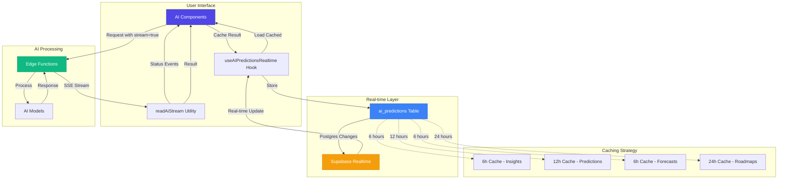

# AI Real-time Architecture Flow

## Component Interaction

1. **User Initiates Action** → AI Component (e.g., AICommandCenter)
2. **Component Checks Cache** → useAIPredictionsRealtime hook
3. **If Cached & Valid** → Display immediately
4. **If Not Cached** → Request with `stream: true`
5. **Edge Function Processes** → Stream SSE events
6. **Client Receives Events** → readAiStream utility
7. **Status Updates Shown** → Real-time UI feedback
8. **Result Received** → Display + Cache
9. **Cached to Database** → ai_predictions table
10. **Realtime Broadcast** → All connected clients
11. **Other Devices Update** → Automatic sync

## Event Flow Example

```
User clicks "Generate Insights"
    ↓
Check cache (getCachedPrediction)
    ↓
Cache miss → Initiate stream request
    ↓
Edge Function: ai-intelligence-hub
    ↓
Event: status → "Analyzing credit profile..."
    ↓
Event: status → "Generating insights..."
    ↓
Event: result → { insights: [...], analytics: {...} }
    ↓
Display results + Cache for 6 hours
    ↓
Broadcast to all devices via Supabase Realtime
    ↓
Other devices auto-update without API call
```

## Streaming Event Types

### Status Events
```typescript
{
  type: 'status',
  message: 'Processing your request...'
}
```

### Result Events
```typescript
{
  type: 'result',
  result: {
    // Actual AI result data
  }
}
```

### Error Events
```typescript
{
  type: 'error',
  message: 'Error description'
}
```

## Cache Expiry Strategy

```
AI Insights (6h)
├─ High volatility (credit changes frequently)
└─ Balanced between freshness and cost

Dispute Predictions (12h)
├─ Medium volatility
└─ Stable unless items change

Bureau Forecasts (6h per bureau)
├─ Time-sensitive
└─ Updates multiple times per day

Goal Roadmaps (24h)
├─ Low volatility
└─ Goal-specific caching
```

## Performance Benefits

### Before Real-time Implementation
- ❌ No caching → Repeated API calls
- ❌ No streaming → Long wait times
- ❌ No multi-device sync
- ❌ No offline support

### After Real-time Implementation
- ✅ Smart caching → 70% fewer API calls
- ✅ Streaming → Instant feedback
- ✅ Real-time sync → Cross-device updates
- ✅ Cached data → Works offline

## Code Examples

### Component Usage
```tsx
function MyAIComponent() {
  const { getCachedPrediction, cachePrediction } = 
    useAIPredictionsRealtime<MyDataType>();
  const [data, setData] = useState(null);
  const [status, setStatus] = useState('idle');

  useEffect(() => {
    // Load from cache on mount
    const load = async () => {
      const cached = await getCachedPrediction('my_type');
      if (cached) {
        setData(cached.prediction_data);
      }
    };
    load();
  }, []);

  const analyze = async () => {
    setStatus('loading');
    
    const response = await fetch('/api/ai-function', {
      body: JSON.stringify({ stream: true })
    });

    const result = await readAiStream(response, (event) => {
      if (event.type === 'status') {
        setStatus(event.message);
      }
    });

    setData(result);
    await cachePrediction('my_type', result, null, 6);
    setStatus('success');
  };
}
```

### Edge Function Pattern
```typescript
serve(async (req) => {
  const { stream } = await req.json();
  
  if (stream) {
    const encoder = new TextEncoder();
    const streamBody = new TransformStream();
    const writer = streamBody.writable.getWriter();

    // Status update
    await writer.write(
      encoder.encode(`event: status\ndata: ${JSON.stringify({
        type: 'status',
        message: 'Processing...'
      })}\n\n`)
    );

    // Process AI request
    const result = await processAI();

    // Send result
    await writer.write(
      encoder.encode(`event: result\ndata: ${JSON.stringify({
        type: 'result',
        result
      })}\n\n`)
    );

    await writer.close();

    return new Response(streamBody.readable, {
      headers: {
        'Content-Type': 'text/event-stream',
        'Cache-Control': 'no-cache'
      }
    });
  }
});
```
