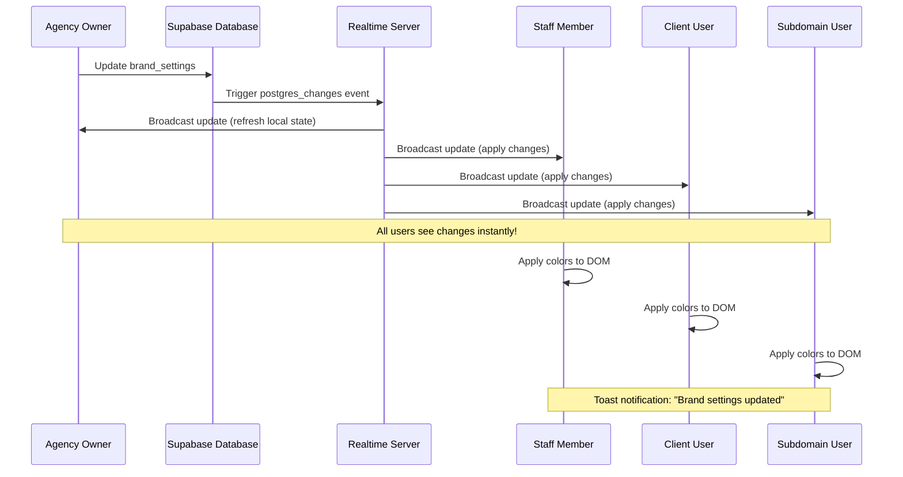

# Real-Time White Label Flow

## Update Propagation
1. Agency owner updates brand settings
2. Database saves changes and triggers update
3. Realtime server broadcasts to all subscribed clients
4. All users receive and apply changes instantly

## Components with Real-Time Subscriptions

### BrandContext (Main Provider)
- Monitors: `brand_settings` by `agency_id`
- Applies: Colors, CSS, favicon, title, button styles
- Scope: All authenticated users in the agency

### useBrandSettings Hook
- Monitors: `brand_settings` by `agency_id`
- Updates: Form data and settings state
- Scope: Settings management interface

### useSubdomainDetection Hook
- Monitors: `brand_settings` by `subdomain`
- Applies: Full white-label config for subdomain users
- Scope: Unauthenticated and subdomain users

## Channel Names
- BrandContext: `brand_settings_{agency_id}`
- useBrandSettings: `brand_settings_hook_{agency_id}`
- useSubdomainDetection: `subdomain_{subdomain_name}`

Each channel is uniquely named to prevent conflicts and properly cleaned up on unmount.

## Event Handling

### UPDATE Event
- Receives new data from database
- Updates local state
- Applies visual changes to DOM
- Shows toast notification (except in BrandContext)

### INSERT Event
- Same as UPDATE
- Handles first-time brand settings creation

### DELETE Event
- Resets to default brand settings
- Shows notification
- Clears custom branding
